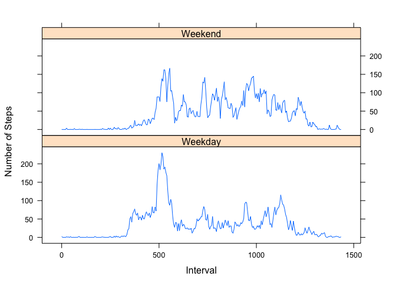

# Reproducible Research: Peer Assessment 1

## Loading and preprocessing the data
  
Load the data directly from the zip file in the repository:

```r
data <- read.csv(unz("activity.zip", "activity.csv"), stringsAsFactors = FALSE)
```
  
Convert date column to 'Date' class:

```r
data$date <- as.Date(data$date, format = "%Y-%m-%d")
```
  
Convert intervals into minutes since midnight (from time in hourminuteminute format):

```r
data$interval <- (data$interval %% 100) + as.integer(data$interval / 100) * 60
```
  
## What is mean total number of steps taken per day?
  
Create vector with each unique date:

```r
dates <- unique(data$date)
```
  
Create vector with the total steps for each of those dates, ignoring NA values:

```r
steps.by.date <- sapply(dates, FUN = function(x) {sum(data$steps[data$date == x], na.rm = TRUE)})
```
  
Plot histogram of the number of steps per day:

```r
hist(steps.by.date, breaks = 10)
```

 
  
The mean number of steps per day is: **9354.23**  
The median number of steps per day is: **10395**  
The code to obtain the above results:

```r
round(mean(steps.by.date), 2)
median(steps.by.date)
```
## What is the average daily activity pattern?
  
Create a vector for each 5 minute interval unique:

```r
intervals <- unique(data$interval)
```
  
Create a vector for the mean number of steps per interval, across all dates, removing NA's:

```r
mean.steps.by.interval <- sapply(intervals, FUN = function(x) {
  mean(data$steps[data$interval == x], na.rm = TRUE)})
```
Make a line plot of the mean steps per interval, showing the average frequency by time of day:

```r
plot(intervals, mean.steps.by.interval, type = 'l')
```

 
  
The interval with the most steps on average is:
**515** minutes after midnight.  
There are an average of **206.17** steps per 5 minutes in that interval.    
The code to obtain the above results:

```r
intervals[which.max(mean.steps.by.interval)]
round(max(mean.steps.by.interval),2)
```
## Imputing missing values
  
The total number of NA values (all in `steps`) is:

```r
sum(is.na(data$steps))
```

```
## [1] 2304
```
The missing steps values, coded as NA, will be imputed. Each NA will be replaced with the mean
number of steps for that interval, computed above. A new data frame, `imputed.data`, is created
with `imputed.data$steps` containing the original data with the NA's replaced. The other columns are
identical to `data`:

```r
imputed.steps <- as.integer(apply(data, 1, function(row) {
  if(is.na(row["steps"]))
    row["steps"] <- as.integer(round(
      mean.steps.by.interval[intervals == as.numeric(row["interval"])]))
  return(row["steps"])}))
imputed.data <- data
imputed.data$steps <- imputed.steps
```
  
A vector is created with the steps by date calculated with the missing data replaced:

```r
steps.by.date.imputed <- sapply(dates, FUN = function(x) {
  sum(imputed.data$steps[dates == x])})
```
  
The histogram, mean, and median from above are recreated from the missing value-imputed data:

```r
hist(steps.by.date.imputed, breaks = 7)
```

 

```r
mean(steps.by.date.imputed)
```

```
## [1] 10765.64
```

```r
median(steps.by.date.imputed)
```

```
## [1] 10789
```
  
In the above histogram the number of bins was reduced to more accurately show the new distribution.  

## Are there differences in activity patterns between weekdays and weekends?
  
A new column in `imputed.data` is a factor indicating if a day is a weekday or weekend:

```r
imputed.data$weekend <- as.factor(sapply(weekdays(imputed.data$date), function(x) {
  if (x == "Saturday" || x == "Sunday")
    return("weekend")
  return("weekday")
}))
```
  
Two vectors are created, one for weekdays and one for weekends, with the average number of steps by interval
over for dates in those two groups:

```r
mean.steps.weekend <- sapply(intervals, FUN = function(x) {
  mean(imputed.data$steps[imputed.data$interval == x & imputed.data$weekend == "weekend"])
  })
mean.steps.weekday <- sapply(intervals, FUN = function(x) {
  mean(imputed.data$steps[imputed.data$interval == x & imputed.data$weekend == "weekday"])
  })
```
  
Create a data frame combining the mean step by day of week data into a "long" format and then plot it with
`xyplot()` from the lattice package:

```r
library(lattice)
day.of.week <- data.frame(Interval = c(intervals,intervals), 
                          frequency = c(mean.steps.weekday, mean.steps.weekend),
                          day.type = factor(rep(c("Weekday", "Weekend"), each=length(intervals))))
                          
xyplot(frequency ~ Interval | day.type, data=day.of.week, type = 'l', ylab = "Number of Steps", layout = c(1,2))
```

 

